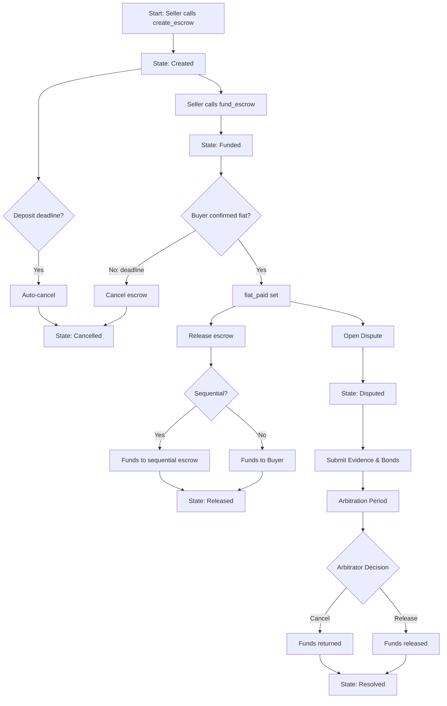

# YapBay Solidity Escrow Contract Requirements

## MVP with Dual Deadlines, Pre-Defined Sequential Escrow & Integrated Dispute Resolution but Zero Platform Fees

This document details the requirements for an on-chain escrow contract written in Solidity for deployment on the Arbitrum Sepolia testnet. 

The contract implements a sequential escrow mechanism for both P2P and chained remittance trades using USDC, with comprehensive dispute resolution capabilities. It enforces strict rules for deposit, fiat confirmation, cancellation, release and dispute handling.


## 1. Overview and Objectives

**Purpose:**  
Provide a secure on-chain escrow mechanism that locks USDC (up to 100 USDC per escrow in the MVP) until trade conditions are met. Depending on the outcome:
- Funds are released to the Buyer (or, in sequential chains, transferred into a pre-created sequential escrow account for leg2) when the trade is successful.
- Funds are returned to the Seller if the escrow is canceled or any dispute is resolved in the Seller's favor.
- Provides a comprehensive dispute resolution system with evidence management and bonded participation.

**Key Objectives:**  
- Enforce a strict state flow:  
  Creation → Funding → (Fiat Confirmation → Release / Cancellation / Dispute → Resolution)
- Clearly define roles:
  - **Seller:** Creates, funds and (in normal flow) releases or cancels the escrow. May only open disputes after fiat is confirmed.
  - **Buyer:** Receives funds; must confirm fiat payment on-chain by calling `mark_fiat_paid`. For sequential trades, must pre-create leg2 escrow account.
  - **Arbitrator:** A designated address that resolves disputes, triggers auto-cancellation, and manages the bonded dispute process.
- Support chained remittance trades via boolean flag `sequential`
- Use USDC only for now
- Enforce two deadlines:
  - **Deposit Deadline:** 15 minutes from order initiation
  - **Fiat Payment Deadline:** 30 minutes after funding
- Implement comprehensive dispute resolution with:
  - 5% transaction value bonds from both parties
  - 72-hour response deadlines
  - Evidence management system with PDF + text submissions
  - Structured arbitration process
  - Automated bond and funds distribution
- Follow trade identifier convention (e.g., trade 45 becomes 4500 for leg1 and 4501 for leg2)
- Ensure that once fiat is confirmed on-chain, the Seller is disallowed from canceling
- For sequential trades, require pre-defined sequential escrow address


## 2. Scope and Assumptions

**Scope:**  
- Implements on-chain escrow operations: creation, funding, marking fiat as paid, release, cancellation
- Supports both standard (P2P) escrow and sequential (chained remittance) trades
- Enforces two deadlines for deposits and fiat payment
- Implements complete dispute resolution system:
  - Bond management (5% of transaction value)
  - Evidence submission and storage
  - Arbitration process
  - Resolution enforcement
- Maintains dispute records in PostgreSQL with evidence hashing
- Provides API endpoints for dispute management and evidence handling

**Assumptions:**  
- All token operations use USDC exclusively for now
- Deadlines measured using on-chain timestamps (probably the better choice) or block heights
- Seller, Buyer and Arbitrator addresses authenticated through the Solidity runtime
- Trade identifiers follow the agreed convention
- Users obtain wallets via dynamic.xyz or similar at account creation
- Funds remain under on-chain custody
- AWS S3 available for evidence storage
- Arbitrator address is fixed at deployment

## 3. Data Structures and State Variables

### Escrow Record

Each escrow instance is represented by a struct with the following fields:

**Base Fields:**
- **escrow_id (uint256):**  
  A unique identifier.
- **trade_id (uint256 or string):**  
  An off-chain trade identifier that follows the convention (e.g., 4500 for leg1, 4501 for leg2) to distinguish each trade and its leg.
- **seller (address):**  
  The Seller’s address responsible for creating, funding and (in normal flow) releasing or canceling the escrow.
- **buyer (address):**  
  The Buyer’s address designated to receive the funds.  
  *Note:* In leg1 of a sequential trade, the Buyer is required to pre-create and supply the address of their leg2 escrow account.
- **arbitrator (address):**  
  A fixed address defined at deployment responsible for dispute resolution and auto-cancellation.
- **amount (uint256):**  
  The USDC amount (in the smallest denomination) to be deposited.  
  **Constraint:** Must not exceed the equivalent of 100 USDC.
- **deposit_deadline (uint256):**  
  A timestamp indicating the deadline (15 minutes from initiation) by which the escrow must be created and funded.
- **fiat_deadline (uint256):**  
  A timestamp indicating the deadline (30 minutes after funding) by which the Buyer must call `mark_fiat_paid`.
- **state (EscrowState):**  
  Enumerated values representing the current state:
  - `Created` – Escrow initialized but not yet funded.
  - `Funded` – Funds have been deposited.
  - `Released` – Funds have been released (either directly to the Buyer or into the sequential escrow for leg2).
  - `Cancelled` – Escrow cancelled; funds returned to the Seller.
  - `Disputed` – A dispute has been opened.
  - `Resolved` – Dispute resolution is complete.
- **sequential (bool):**  
  Indicates if the escrow is part of a chained remittance trade.  
  If `true`, then the Buyer must provide the address of the pre-created leg2 escrow account.
- **sequential_escrow_address (address):**  
  **Mandatory if** `sequential == true`.  
  Holds the address of the pre-created leg2 escrow account.
- **fiat_paid (bool):**  
  A flag set by the Buyer via `mark_fiat_paid` when fiat payment is confirmed. Once set, cancellation by the Seller is disallowed.
- **counter (uint256):**  
  A sequential marker that increments on each valid state transition for audit logging and event correlation.

**Dispute-Related Fields:**
- **dispute_initiator (address):**  
  Address of the party that initiated the dispute.
- **dispute_bond_buyer (uint256):**  
  Buyer's dispute bond (5% of the transaction value) held in USDC.
- **dispute_bond_seller (uint256):**  
  Seller's dispute bond (5% of the transaction value) held in USDC.
- **dispute_initiated_time (uint256):**  
  The timestamp when the dispute was initiated.
- **dispute_evidence_hash_buyer (bytes32):**  
  SHA-256 hash of the buyer’s evidence submission.
- **dispute_evidence_hash_seller (bytes32):**  
  SHA-256 hash of the seller’s evidence submission.
- **dispute_resolution_hash (bytes32):**  
  SHA-256 hash of the written dispute resolution decision.

### State Enumeration
```solidity
enum EscrowState {
    Created,
    Funded,
    Released,
    Cancelled,
    Disputed,
    Resolved
}
```

### Database Schema Additions

```sql
CREATE TABLE dispute_evidence (
    id SERIAL PRIMARY KEY,
    escrow_id BIGINT REFERENCES escrows(id),
    trade_id BIGINT REFERENCES trades(id),
    submitter_address TEXT NOT NULL,
    submission_time TIMESTAMP WITH TIME ZONE DEFAULT CURRENT_TIMESTAMP,
    evidence_text TEXT NOT NULL,
    pdf_s3_path TEXT NOT NULL,
    evidence_hash TEXT NOT NULL,
    is_initial_submission BOOLEAN DEFAULT FALSE
);

CREATE TABLE dispute_resolutions (
    id SERIAL PRIMARY KEY,
    dispute_id BIGINT REFERENCES disputes(id),
    arbitrator_address TEXT NOT NULL,
    resolution_time TIMESTAMP WITH TIME ZONE DEFAULT CURRENT_TIMESTAMP,
    decision TEXT NOT NULL,
    decision_explanation TEXT NOT NULL,
    decision_hash TEXT NOT NULL,
    winner_address TEXT NOT NULL,
    funds_destination TEXT NOT NULL
);
```


## 4. Functional Requirements

### A. Escrow Creation

**Function:**  
`create_escrow(seller, buyer, arbitrator, amount, deposit_deadline, fiat_deadline, trade_id, sequential, sequential_escrow_address?)`

**Preconditions:**
- Must be called by the Seller.
- Valid addresses for Seller, Buyer, and Arbitrator.
- Amount must be non-zero and ≤100 USDC.
- Valid deposit and fiat deadlines (15 and 30 minutes, respectively).
- A valid `trade_id` is provided following the agreed convention.
- If `sequential == true`, the Buyer must provide `sequential_escrow_address`.

**Postconditions:**
- A new escrow instance is created in state `Created`.
- A unique `escrow_id` is assigned.
- An **EscrowCreated** event is emitted with details including `trade_id`, `sequential` flag, deadlines, and (if sequential) the `sequential_escrow_address`.


### B. Funding the Escrow

**Function:**  
`fund_escrow(escrow_id, coin)`

**Preconditions:**
- Escrow state must be `Created`.
- The coin provided must be USDC and match the `amount` exactly.
- Funding must occur before the deposit_deadline.

**Postconditions:**
- USDC funds are locked in the escrow.
- State transitions from `Created` to `Funded`.
- A **FundsDeposited** event is emitted with details including `escrow_id`, `trade_id`, the deposited amount, counter update, and timestamp.


### C. Marking Fiat as Paid

**Function:**  
`mark_fiat_paid(escrow_id)`

**Preconditions:**
- Escrow must be in the `Funded` state.
- Must be called by the Buyer.
- Must occur before the fiat_deadline expires.

**Postconditions:**
- The `fiat_paid` flag is set to true.
- A **FiatMarkedPaid** event is emitted with details including `escrow_id`, `trade_id`, and timestamp.
- For sequential trades, if the sequential escrow address was not supplied during creation, the Buyer must update the record before release.

### D. Updating the Sequential Escrow Address

Function: update_sequential_address(escrow_id, new_sequential_address)

Preconditions:
 – The escrow must be marked as sequential (sequential == true).
 – The caller must be the Buyer.
 – The escrow is not already in a terminal state (i.e. not Released, Cancelled, or Resolved).
 – The new_sequential_address must be a valid non-zero address.

Postconditions:
 – The escrow’s sequential_escrow_address field is updated with the new address.
 – An event (e.g. SequentialAddressUpdated) is emitted capturing the escrow_id, old address, and the new sequential address.

### E. Releasing the Escrow

**Function:**  
`release_escrow(escrow_id)`

**Preconditions:**
- Escrow must be in the `Funded` state.
- The `fiat_paid` flag must be set to true (or, in dispute resolution, the Arbitrator may override).
- Only the Seller (in normal flow) or the Arbitrator (in dispute resolution) may call this function.
- If `sequential == true`, the escrow record must contain a valid `sequential_escrow_address`.

**Postconditions:**
- **Standard Trade (`sequential == false`):**  
  Funds are transferred directly to the Buyer and the state transitions to `Released`.
- **Sequential Trade (`sequential == true`):**  
  Funds are transferred to the pre-defined sequential escrow account (at `sequential_escrow_address`) and the state transitions to `Released`.
- The counter is incremented and an **EscrowReleased** event is emitted with details including `escrow_id`, `trade_id`, buyer, amount, counter, timestamp, and a destination indicator (e.g., "direct to buyer" or "sequential escrow [trade_id]").


### F. Cancelling the Escrow

**Function:**  
`cancel_escrow(escrow_id)`

**Preconditions:**
- Escrow must be in the `Created` or `Funded` state.
- For a funded escrow:
  - Cancellation is allowed if fiat has not been marked as paid and the fiat_deadline has expired.
  - Cancellation is disallowed if fiat has been marked as paid.
- Cancellation may also be triggered by the Arbitrator (e.g., via auto-cancellation) if deadlines are exceeded.

**Postconditions:**
- Funds are returned to the Seller.
- The state transitions to `Cancelled`.
- A **EscrowCancelled** event is emitted with details including `escrow_id` and `trade_id`.


### G. Dispute Handling

#### 1. Dispute Initiation

**Function:**  
`open_dispute_with_bond(escrow_id, evidence_hash)`

**Preconditions:**
- Escrow must be in the `Funded` state.
- Fiat must be confirmed (`fiat_paid == true`).
- Caller (either Buyer or Seller) posts a 5% bond in USDC.
- Initiation must occur within the valid dispute initiation period.

**Postconditions:**
- A 5% bond is locked from the disputing party.
- The escrow state transitions to `Disputed`.
- The supplied evidence hash is stored in the escrow record.
- A **DisputeOpened** event is emitted with details including `escrow_id`, `trade_id`, initiator, bond amount, and timestamp.


#### 2. Dispute Response

**Function:**  
`respond_to_dispute_with_bond(escrow_id, evidence_hash)`

**Preconditions:**
- Escrow must be in the `Disputed` state.
- The caller must be the opposing party.
- Must be invoked within 72 hours of dispute initiation.
- The caller posts a 5% bond in USDC.

**Postconditions:**
- A 5% bond is locked from the responding party.
- The responder’s evidence hash is stored.
- A **DisputeResponse** event is emitted with details including `escrow_id`, responder, bond amount, and evidence hash.

### A. default_judgment

Function: default_judgment(escrow_id)

Preconditions:
 – The escrow must be in the Disputed state.
 – The caller must be the designated Arbitrator.
 – The dispute response period (72 hours from the dispute initiation) has expired, meaning the opposing party failed to submit their bond and evidence.
 – The escrow must have a recorded dispute initiator and at least one evidence hash submitted by that party.

Postconditions:
 – The escrow is marked as “Resolved” via default judgment.
 – Funds are automatically transferred according to the default outcome (return to Seller if the non-responding party defaults, or release to Buyer if they initiated and the seller did not respond).
 – The default judgment event is emitted with details of the decision and the winning party.
 – The appropriate bond (or a portion of it) is returned to the winning party while the losing party’s bond is allocated for arbitration costs.

#### 3. Evidence Management

**Submission Requirements:**
- The dispute initiator and responder must submit evidence comprising:
  - One PDF document (maximum 5MB) following a given template.
  - One text statement (≤1000 characters) summarizing their position.
- A SHA-256 hash is calculated for each PDF and text submission and recorded on-chain.
- The evidence (metadata and content references) is stored off-chain in an AWS S3 bucket; PostgreSQL tracks evidence submissions.
- Submissions beyond the 72-hour window are rejected.

**Privacy Controls:**
- Evidence remains sealed (not viewable by the opposing party) until the submission period ends.
- Access controls (both in the database and file storage) enforce privacy until the deadline passes.


#### 4. Arbitration Process

**Function:**  
`resolve_dispute_with_explanation(escrow_id, decision, explanation_hash)`

**Preconditions:**
- Escrow must be in the `Disputed` state.
- The function must be called by the assigned Arbitrator.
- Resolution must occur within 168 hours (7 days) after evidence submission ends.
- All required evidence must be submitted.

**Postconditions:**
- Depending on the Arbitrator’s decision:
  - If `decision == true`: Funds are released (to Buyer or to sequential escrow).
  - If `decision == false`: Escrow is cancelled and funds returned to the Seller.
- Bonds are handled accordingly:
  - The winning party gets their bond returned.
  - The losing party’s bond is used for arbitration costs and platform maintenance.
- The explanation (written decision up to 2000 characters) is hashed and stored on-chain.
- A **DisputeResolved** event is emitted with details including `escrow_id`, decision, explanation hash, and bond allocation.
- The state transitions to `Resolved`.


### H. Auto-Cancellation on Deadline

**Function:**  
`auto_cancel(escrow_id)`

**Preconditions:**
- Can only be executed by the Arbitrator.
- The current on-chain timestamp exceeds the deposit deadline (for unfunded escrows) or the fiat payment deadline (for funded escrows where fiat is not confirmed).
- Escrow must not already be in a terminal state (`Released`, `Cancelled`, or `Resolved`).

**Postconditions:**
- Funds are returned to the Seller.
- The state is updated to `Cancelled`.
- A **EscrowCancelled** event is emitted, documenting the cancellation due to deadline expiry.


## 5. Event Logging

Every critical action emits an event for transparency and auditability:

**Base Escrow Events:**
- **EscrowCreated:**  
  Parameters: `escrow_id`, `trade_id`, seller, buyer, arbitrator, amount, deposit_deadline, fiat_deadline, sequential flag, (if sequential, the `sequential_escrow_address`), timestamp.
- **FundsDeposited:**  
  Parameters: `escrow_id`, `trade_id`, deposited amount, updated counter, timestamp.
- **FiatMarkedPaid:**  
  Parameters: `escrow_id`, `trade_id`, timestamp.
- **EscrowReleased:**  
  Parameters: `escrow_id`, `trade_id`, buyer, released amount, updated counter, timestamp, and destination indicator.
- **EscrowCancelled:**  
  Parameters: `escrow_id`, `trade_id`, seller, refunded amount, updated counter, timestamp.

**Dispute-Related Events:**
- **DisputeOpened:**  
  Parameters: `escrow_id`, `trade_id`, initiator, bond amount, timestamp.
- **DisputeResponse:**  
  Parameters: `escrow_id`, responder, bond amount, evidence hash.
- **EvidenceSubmitted:**  
  Parameters: `escrow_id`, submitter, evidence hash, timestamp.
- **DisputeResolved:**  
  Parameters: `escrow_id`, decision, explanation hash, bond allocation.


## 6. Error Handling and Security

### Error Code Mapping

| Error Code | Description                                                  |
|------------|--------------------------------------------------------------|
| E100       | Invalid amount: Zero or negative value provided              |
| E101       | Amount exceeds maximum limit (100 USDC)                      |
| E102       | Unauthorized caller: Function called by invalid user         |
| E103       | Deposit deadline expired                                     |
| E104       | Fiat payment deadline expired                                |
| E105       | Invalid escrow state transition                              |
| E106       | Missing sequential escrow address                            |
| E107       | Escrow in terminal state                                     |
| E110       | Insufficient dispute bond                                    |
| E111       | Evidence submission expired                                  |
| E112       | Invalid evidence format                                      |
| E113       | Arbitration deadline exceeded                                |
| E114       | Invalid evidence hash                                        |
| E115       | Unauthorized evidence access attempt                         |

### Security Controls

**Input Validation:**
- Reject zero or negative amounts.
- Enforce the 100 USDC maximum.
- Validate all addresses.
- Verify evidence hashes.

**Authorization:**
- Enforce role-based access for functions (Seller for creation/funding, Buyer for fiat confirmation, Arbitrator for dispute resolution).
- Control access to evidence based on roles.
- Enforce bond verification logic.
- Strict deadline enforcement.

**Evidence Security:**
- AWS S3 encryption for stored evidence.
- Hash verification against on-chain records.
- Access logging and retention policies.


## 7. Technical Integration Requirements

### Smart Contract Modifications
- Implement new dispute management functions:
  - `open_dispute_with_bond`
  - `respond_to_dispute_with_bond`
  - `resolve_dispute_with_explanation`
- Introduce bond handling logic.
- Track evidence hashes and dispute resolution evidence on-chain.
- Enhance resolution enforcement logic and update state accordingly.

### API Layer
- Provide endpoints for evidence submission and retrieval.
- Enable dispute status tracking.
- Implement arbitrator interfaces and endpoints for hash verification.

### User Interface
- Develop a dispute initiation workflow.
- Include evidence submission forms and clear instructions.
- Build an arbitrator dashboard.
- Set up a resolution notification system with detailed summaries.


## 8. Testing Requirements

### Test Categories
- **Unit Tests:** Verify each smart contract function individually.
- **Integration Tests:** Validate complete escrow flows including sequential and dispute processes.
- **Security Tests:** Test access controls, bond handling, and evidence hash verification.
- **Load Testing:** Simulate multiple concurrent disputes and evidence submissions.
- **UI/UX Testing:** Ensure smooth user interaction for dispute initiation, submission, and resolution flows.

### Specific Test Cases
- Standard escrow creation, funding, fiat confirmation, and release.
- Sequential escrow flows with pre-defined sequential escrow address.
- Dispute initiation, evidence submission, bond handling, and resolution.
- Negative cases: funding/escaping after deadlines, unauthorized calls, invalid inputs.
- Event logging verification (including the correct error codes).


## 9. Future Roadmap

### Appeal System
- Enable multi-arbitrator panels.
- Increase bond requirements for high-value disputes.
- Extend evidence submission periods for appeals.

### Reputation System
- Track and display user dispute history.
- Develop a reputation scoring algorithm.
- Integrate dispute history into user profiles.

### Community Arbitration
- Transition from centralized to community-based arbitration.
- Implement a qualification and selection system for arbitrators.
- Introduce incentive structures for community arbitrators.

### Signature-Based Verification for Sequential Escrow Address
- Instead of allowing the Seller to set/update the sequential escrow address, require the Buyer to provide a digital signature proving control of the address.

### Gasless Transactions
- Future integration for sponsored transactions to reduce user gas fees.


## 10. Escrow Flow Diagram

